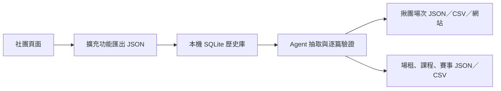

# social-play-finder

將社群貼文整理成可搜尋的運動資訊，協助尋找揪團、場租、課程與賽事。

目前從 Facebook 社團擷取貼文，保存原始資料與歷史觀察，透過 AI 抽取成可追溯的結構化資料，再產生可直接開啟的場次網站。

## 從這裡開始

| 你要做什麼 | 閱讀入口 |
| --- | --- |
| 使用網站找場次、比較及複製資訊 | [網站使用指南](docs/user-guide.md)；不需安裝開發工具 |
| 爬取社團、抽取資料、更新網站 | [操作指南](docs/development/post-etl-operations.md) |
| 修改程式、建置與測試 | 本頁的[開發](#開發) |
| 讓 AI Agent 在專案工作 | [專案規範](AGENTS.md)、[抽取 skill](skills/badminton-session-finder/SKILL.md) |

## 能做什麼

- Chrome 擴充功能：讀取社團頁面已呈現的內容，自動捲動、展開本文，下載原始 JSON 與試算表安全 CSV。
- 本機 SQLite：保留每篇貼文的歷史觀察與最新版本，記錄逐篇抽取狀態，支援續跑。
- AI 抽取：將球友揪團、場地租借／轉讓、教練課程、正式賽事分流，保留來源、價格條件與聯絡方式。
- 場次網站：搜尋、玩法篩選、排序、日期分組、作者過濾、選取比較，以及複製表格與原文。



擴充功能只讀取頁面 DOM／可存取性資料，不使用 Facebook 內部 API。AI 抽取是另一步驟：Codex CLI 會將任務 ID 與貼文 context 傳給模型，來源網址由本機程式關聯回結果。

## 看結果

操作人員發布後，把產生的 `index.html` 交給網站使用者；使用者以瀏覽器開啟即可，不需要資料庫、Node.js 或本機伺服器。操作人員的發布目錄內，`current/index.html` 指向最新發布，歷史批次保存在 `releases/`。

| 產物 | 用途 |
| --- | --- |
| `index.html` | 揪團場次網站，內含資料與該批 CSV 下載 |
| `output_result.json`／`.csv` | 完整發布 JSON 與主場次 CSV |
| `venue_rentals.json`／`.csv` | 場地租借、轉讓與轉租 |
| `coaching_courses.json`／`.csv` | 教練課程招生 |
| `tournaments.json`／`.csv` | 正式賽事報名 |
| `run_report.json` | 任務完成狀態、筆數與警告 |

網站目前只呈現主場次表，其他三類提供資料檔，尚無專屬網頁。未知資訊保留空白；舊抽取結果不會自動補玩法或重新分流，因此主表仍可能包含尚未重新判讀的課程或場租文。不進行運動項目辨識。

固定週期不代表指定日期一定開團；最低費用可能有性別、同行或時數條件。格式驗證通過也不代表抽取語意全部正確，參加前請查看原文與主揪確認。

## 開發

需求：Node.js 20、npm。使用 Codex 自動抽取時，另需已安裝並登入的 Codex CLI。專案的模型設定與批次大小見 [codex-model.json](skills/badminton-session-finder/codex-model.json)，設定及操作方法集中在[操作指南](docs/development/post-etl-operations.md)。

在專案根目錄執行：

```sh
npm install
npm run build
```

`dist/` 是 Chrome 可載入的擴充功能；載入與擷取步驟見操作指南。網站則由 ETL 發布產生，更新網站程式後需要重新發布，僅執行 build 不會更新網站。

| 指令 | 檢查範圍 |
| --- | --- |
| `npm run test` | 擴充功能單元測試 |
| `npm run test:archive` | SQLite 歷史庫測試 |
| `npm run test:badminton` | 抽取、分流、發布、查詢與網站測試 |
| `npm run check` | TypeScript、上述測試與擴充功能建置 |

| 位置 | 責任 |
| --- | --- |
| `src/` | 擴充功能 popup、背景程序、頁面擷取與匯出 |
| `scripts/post-archive/` | 原始 JSON 匯入與 SQLite 歷史查詢 |
| `skills/badminton-session-finder/` | 抽取指引、schema、ETL、網站產生器與測試；沿用既有路徑名稱 |
| `tests/` | 擴充功能測試 |
| `docs/` | 使用與操作指南、需求、架構決策、歷史紀錄 |

更多文件見[文件索引](docs/README.md)。目前行為以程式及使用／操作指南為準；需求文件供規格追溯，具日期的開發與驗收紀錄描述當時狀態。Facebook 頁面結構可能變動，爬蟲修改除程式測試外，仍需依[擴充功能需求](docs/requirements/facebook-group-post-exporter.md)的 live smoke test 情境實際驗證。


## GitHub 與靜態網站發布

正式流程使用 Node.js／npm，不需要 Python 或 uv。首次取得原始碼時執行 `npm ci`，再以 `npm run check` 檢查。

`site/index.html` 是納入版本控制的網站快照，包含頁面程式、場次資料與 CSV 下載。`result/`、`output/`、本機環境與 `dist/` 不提交。網站快照包含原文、作者及聯絡資訊；公開網站與公開 repository 都會公開其中的資料。

建立空的 GitHub repository 後，將下列 remote 換成自己的網址：

```sh
git add .
git diff --cached --stat
git commit -m "Initial project with static site deployment"
git remote add origin https://github.com/OWNER/REPOSITORY.git
git push -u origin main
```

在 GitHub repository 的 **Settings → Pages → Build and deployment → Source** 選擇 **GitHub Actions**。若首次推送時尚未啟用 Pages，啟用後到 Actions 手動執行 **Deploy site to GitHub Pages**。後續推送 `main` 的 `site/` 變更會自動部署；部署網址顯示在 Actions 的 `github-pages` environment。流程只上傳 `site/`。

日常更新依[靜態網站發布流程](docs/development/post-etl-operations.md#靜態網站發布)：本機 ETL 發布 → 驗證 → 更新網站快照 → commit／push → 確認部署。本機發布不會自動更新線上網站；GitHub Actions 直接部署已提交的 `site/`，不需要本機資料庫或模型登入。

[GitHub Pages 自訂工作流程說明](https://docs.github.com/en/pages/getting-started-with-github-pages/using-custom-workflows-with-github-pages)
